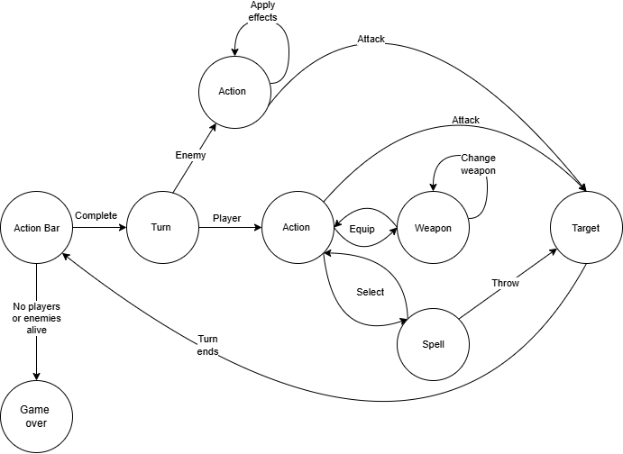

# Final Reality

Final Reality is a simplified clone of the renowned game, Final Fantasy. Its main purpose is to serve as an educational tool, teaching foundational programming concepts.

## Overview

This project aims to replicate the combat system of Final Fantasy, a game developed by [Square Enix](https://www.square-enix.com). In Final Reality, players control a group of characters to battle against computer-controlled enemies.

## Features

### Characters

- **Player Characters**: These are characters controlled by the player. They can be either common or magic characters.
  - **Common Characters**: These include Ninjas, Paladins, and Warriors.
  - **Magic Characters**: These include Black Mages and White Mages.

- **Enemy Characters**: These are characters controlled by the computer. Each enemy has a name, health points, defense, attack, and weight.

### Weaponry

- **Common Weapons**: Weapons used by common characters, such as Axes, Bows, and Swords.
- **Magic Weapons**: Weapons used by magic characters, such as Staves and Wands. Magic weapons have additional magic attack points used to calculate spell damage.

### Party

The party represents a group of characters controlled by the player. Each character can equip one weapon to attack.

### Turn Scheduler

The Turn Scheduler manages the turn order of characters during combat by handling their action bars. The action bar of each unit is filled based on their weight and the weight of their equipped weapon.

### Spells

Mages can use spells with various effects. Spells are categorized into black magic and white magic, used by Black Mages and White Mages, respectively.

- **[Dark Magic] Thunder**: Reduces the enemy's health and has a 30% chance to paralyze them.
- **[Dark Magic] Fire**: Reduces the enemy's health and has a 20% chance to burn them.
- **[Light Magic] Healing**: Heals an ally for 30% of their maximum health points.
- **[Light Magic] Poison**: Poisons an enemy.
- **[Light Magic] Paralysis**: Paralyses an enemy.

### Adverse Effects

Adverse effects are caused by spells and include:

- **Paralysis**: Skips the unit's turn, lasting for one turn.
- **Poisoned**: Causes health loss over four turns.
- **Burned**: Causes health loss over three turns.

### Combat System

The combat system operates in turns, determined by the action bar of each unit:

1. All units start with an action bar at 0.
2. Increase the action bar of all units simultaneously by a fixed amount.
3. Units that fill their action bar take their turn, applying any adverse effects.
4. Units perform an action (attack or cast a spell).
5. The action bar is reset, and the cycle repeats until the battle ends.

## Project Structure

- `characters`: Contains character classes, including both player and enemy characters.
- `weaponry`: Contains classes representing different types of weapons.
- `party`: Contains the class representing the player's party.
- `turn_scheduler`: Contains the TurnScheduler class.

## State Diagram

## Contributing

Contributions to Final Reality are welcome! Feel free to fork this repository and submit pull requests with your changes. Please ensure that your contributions align with the project's goals and follow the existing code style and conventions.

## License

This project is licensed under the [Creative Commons Attribution 4.0 International License](https://creativecommons.org/licenses/by/4.0/).